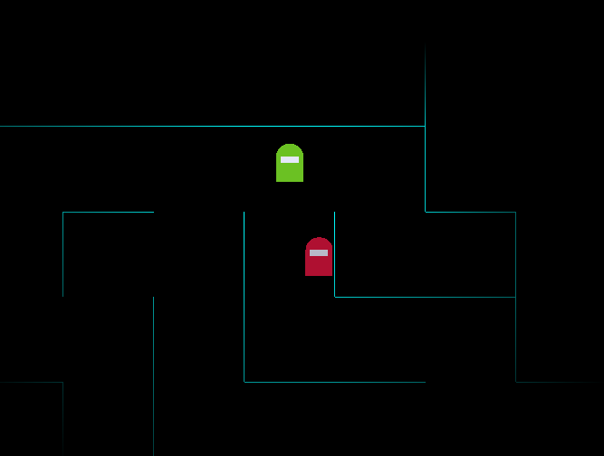

# Single Player Among Us 
Explore a procedurally generated maze and try to complete your tasks before time runs out or the impostor gets you. Toggle the lights for a spookier and more challenging experience!

### Instructions 
To build the game, run the command ```make``` after ensuring that GLAD and GLFW have been installed. This will create an executable named ```Hello-World``` that you can run using the command ```./Hello-World```. This will start up the game in a new window which can be closed at any time using the ```Esc``` key.
### Features
- Smooth movement between maze grid tiles
- 2D sprites inspired from Among Us
- Interaction with the maze environment, all floor tiles spawn randomly
- Impostor equipped with global vision and pathfinding 
- Lighting gradient that hides ares of the maze that are far away from the player


### Controls
To move the character use ```w```, ```a```, ```s``` and ```d```. To interact with any task utilities, simply position your character on top of the floor tiles, the action will take place automatically. Keep an eye out for the score, time left and tasks left (on the top left of the screen) as that indicates whether you completed the task or not! The red square that appears randomly on the maze gets rid of the impostor, the yellow square summons powerups and obstacles (smaller green and red squares that increase/decrease your score) and the green tile lets you escape the maze. To turn the lights off use the ```k``` key, and to turn them back on use the ```l``` key. If the lights are off, you will be rewarded with 2 bonus points for every second that you stay in the maze. 